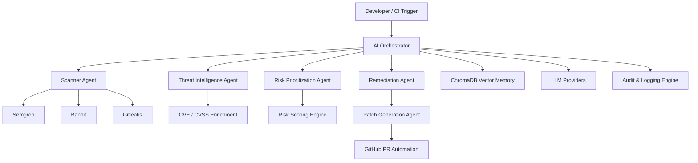

# SecureAgent AI

  <h1 align="center">SecureAgent AI</h1>

  

    <strong>Autonomous DevSecOps Platform Powered by Agentic AI</strong>
  

  

    Scan • Analyze • Prioritize • Remediate • Create PRs Automatically
  

  

    Multi-agent AI system that autonomously detects vulnerabilities, enriches threat intelligence, generates secure patches, and opens production-ready pull requests.
  

  

    
    
    
    
    
    
  

---

# The Problem

Modern development teams ship code rapidly, but security remediation remains slow, manual, and fragmented.

Organizations face:

* Increasing software supply chain attacks
* Delayed vulnerability remediation
* Security team overload
* Alert fatigue from scanners
* Lack of intelligent prioritization
* Manual patching workflows
* Poor DevSecOps automation

Traditional scanners only detect issues.

They do not:

* understand exploitability,
* prioritize business risk,
* generate fixes,
* validate remediation,
* or automate secure pull requests.

This creates a massive gap between **detection and remediation**.

---

# Our Solution

SecureAgent AI bridges that gap using an autonomous multi-agent architecture.

Instead of acting as a passive scanner, SecureAgent AI behaves like an intelligent security engineer capable of:

* Understanding repository context
* Running multi-layer security analysis
* Correlating findings with threat intelligence
* Prioritizing exploitable risks
* Generating secure code patches
* Automatically opening GitHub pull requests
* Maintaining explainable audit trails

The platform transforms DevSecOps from reactive security into autonomous security operations.

---

# Why This Matters

SecureAgent AI reduces:

* Mean Time To Detect (MTTD)
* Mean Time To Remediate (MTTR)
* Manual security engineering effort
* Developer friction
* Vulnerability backlog

while improving:

* Secure software delivery
* CI/CD security posture
* Developer productivity
* Organizational resilience

---

# Key Innovation

## Agentic Security Orchestration

Unlike traditional security pipelines, SecureAgent AI uses specialized AI agents coordinated by a central orchestrator.

Each agent independently reasons about:

* scanning,
* threat intelligence,
* exploitability,
* prioritization,
* remediation,
* and patch validation.

This architecture enables:

* modular intelligence,
* explainability,
* scalability,
* autonomous remediation,
* and future self-healing security systems.

---

# System Architecture

---

# End-to-End Workflow

## Step 1 — Repository Ingestion

The system receives a GitHub repository through:

* UI dashboard
* API request
* CI/CD webhook
* GitHub Actions trigger

---

## Step 2 — Autonomous Security Scanning

Scanner Agent clones the repository and executes:

* Static Application Security Testing (SAST)
* Secret detection
* Dependency analysis
* Misconfiguration analysis
* Code pattern inspection

Integrated tools:

* Semgrep
* Bandit
* Gitleaks

---

## Step 3 — Threat Intelligence Correlation

Threat Intelligence Agent enriches findings using:

* CVE mappings
* CVSS severity
* exploitability metrics
* attack likelihood analysis

This transforms raw alerts into contextualized intelligence.

---

## Step 4 — AI Risk Prioritization

Prioritization Agent evaluates:

* exploitability,
* code exposure,
* severity,
* business impact,
* and confidence scores.

This eliminates alert fatigue and focuses only on actionable risks.

---

## Step 5 — Autonomous Remediation

Remediation Agent:

* generates secure patches,
* suggests safer implementations,
* applies secure coding standards,
* and validates fixes.

Fallback deterministic templates ensure reliability even without LLM access.

---

## Step 6 — Pull Request Automation

Patch Generation Agent:

* creates remediation branches,
* commits secure patches,
* opens GitHub pull requests,
* attaches evidence,
* and documents reasoning.

The result is a production-ready remediation workflow.

---

# Technical Highlights

## Multi-Agent AI Architecture

Specialized autonomous agents with orchestrated collaboration.

## Explainable AI

Every decision includes reasoning logs and audit traces.

## AI + Deterministic Hybrid System

LLMs enhance intelligence while fallback logic guarantees reliability.

## Vector Memory

ChromaDB stores historical findings and remediation patterns.

## CI/CD Native

Designed for modern DevSecOps workflows.

## Production-Oriented Design

Built with scalable backend architecture and modular services.

---

# Tech Stack

## AI & Agents

* CrewAI
* LangChain
* OpenAI
* Gemini

## Backend

* FastAPI
* Python
* AsyncIO

## Frontend

* React
* Tailwind CSS
* Vite

## Security

* Semgrep
* Bandit
* Gitleaks

## Infrastructure

* Docker
* PostgreSQL
* ChromaDB
* GitHub Actions

---

# Competitive Advantage

| Traditional Scanners      | SecureAgent AI              |
| ------------------------- | --------------------------- |
| Detection only            | Detection + Remediation     |
| Manual prioritization     | AI-driven prioritization    |
| Developer-dependent fixes | Autonomous patch generation |
| No workflow automation    | GitHub PR automation        |
| Limited explainability    | Full audit reasoning        |
| Static pipelines          | Adaptive agentic workflows  |

---

# Future Vision

SecureAgent AI can evolve into:

* autonomous security copilots,
* self-healing CI/CD pipelines,
* AI-driven SOC assistants,
* infrastructure security agents,
* runtime remediation systems,
* and enterprise-scale autonomous DevSecOps platforms.

---

# Impact

SecureAgent AI demonstrates how agentic AI can redefine cybersecurity operations by transforming security from passive detection into autonomous remediation.

This project represents the next evolution of DevSecOps:

> AI systems that do not just identify problems — but actively resolve them.
