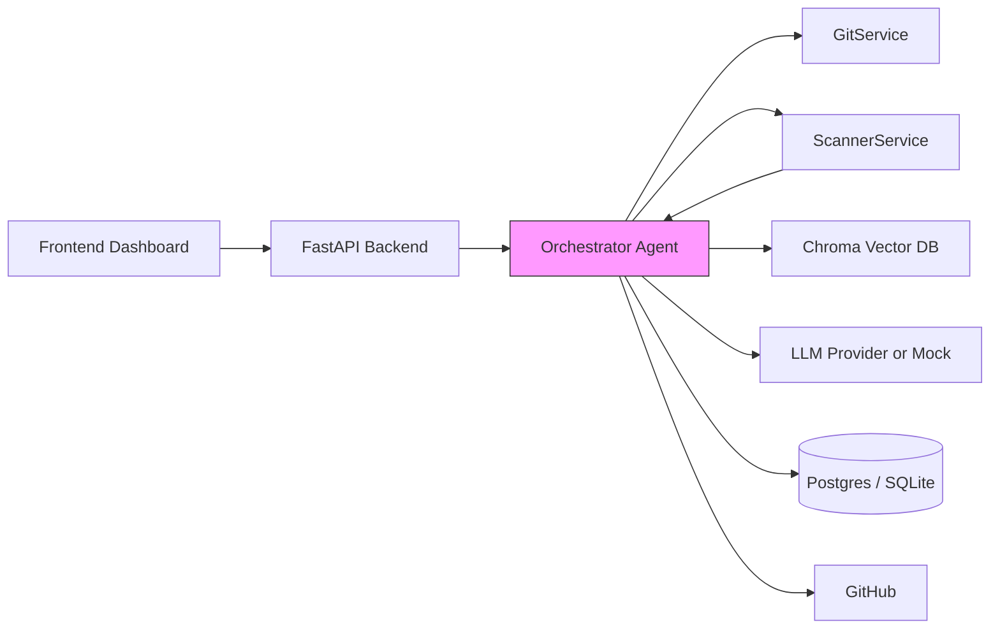

<!-- HERO -->
<p align="center">
  
  <h1 align="center">SecureAgent AI</h1>
  <p align="center"><em>Autonomous DevSecOps — scan, prioritize, patch, and PR</em></p>

</p>


# SecureAgent AI — Agenthon Hackathon Submission

Executive summary
-----------------
SecureAgent AI is an autonomous DevSecOps platform that demonstrates a complete detect→triage→remediate workflow. It integrates open-source static analysis tools, threat intelligence enrichment, prioritized risk reasoning via an agent debate, LLM-assisted remediation with deterministic fallbacks, and automated patching with GitHub pull requests. The project emphasizes reproducibility, explainability, and practical impact.

What the judges should evaluate
------------------------------
- Innovation: autonomous multi-agent orchestration, agent debate system, and LLM remediation strategies.
- Impact: demonstrable reduction of manual remediation steps through automated PR creation and clear risk justification.
- Technical complexity: engineering of background workflows, integration of SAST tools, vector-based RAG, and safe fallback behaviors.
- Presentation: clarity of demo, reproducible steps, and transparent logs for auditability.

High-level architecture
----------------------


Recommended demo flow (concise)
-------------------------------
1. Start the full stack (recommended): `docker-compose up --build`.
2. Open the UI and trigger a scan against `vulnerable-app` under `data/clones/`.
3. Observe agent logs stream: Scanner → Threat Intelligence → Risk Debate → Fix Recommendation → Patch Generation.
4. Open the generated GitHub PR to review the patch, commit message, and agent reasoning recorded in the PR description.

Judging rubric mapping (evidence pointers)
-----------------------------------------
- Innovation (30%): see `backend/app/agents/orchestrator.py` for the debate and multi-agent choreography.
- Impact (30%): evidence of automation in `backend/app/services/git_service.py` (branch/PR automation) and generated PR URLs in `Vulnerability` records.
- Technical complexity (25%): `backend/app/services/scanner_service.py` demonstrates SAST integration and regex/LLM fallback logic.
- Presentation (15%): use the UI and `/api/scans/{scan_id}/logs` to show ordered, timestamped agent logs.

Commands to run (judge-friendly)
--------------------------------
Full stack (recommended):
```bash
docker-compose up --build
```

Backend (development):
```bash
cd backend
python -m venv .venv
.venv\Scripts\activate    # Windows
pip install -r requirements.txt
uvicorn app.main:app --reload --host 0.0.0.0 --port 8000
```

Frontend (development):
```bash
cd frontend
npm install
npm run dev
```

Files and locations for quick inspection
---------------------------------------
- Core orchestration: [backend/app/agents/orchestrator.py](backend/app/agents/orchestrator.py#L1)
- Scanner and fallback rules: [backend/app/services/scanner_service.py](backend/app/services/scanner_service.py#L1)
- Scan trigger endpoints: [backend/app/routers/scans.py](backend/app/routers/scans.py#L1)
- Demo repositories: `data/clones/vulnerable-app`

Assets to include with final submission
--------------------------------------
- `assets/demo.gif` — 20–30s loop of scan → PR creation (recommended)
- `assets/architecture.png` — high-resolution diagram for judge slides
- `assets/one-pager.pdf` — concise project summary for judges

Presentation guidance for judges
--------------------------------
- Begin with the executive summary (30s).
- Trigger the demo scan and narrate agent steps as logs appear (60s).
- Inspect the automated PR and read the agent's reasoning and remediation (30s).

Contact
-------
Project owner: Kishanmc — available for scheduled live demos and technical Q&A during Agenthon.

Next steps
----------
If you would like, I can:
- Generate an `assets/demo.gif` placeholder and a slide deck `slides/pitch.pdf`.
- Produce a short judge-facing checklist that maps UI screens to rubric evidence.
