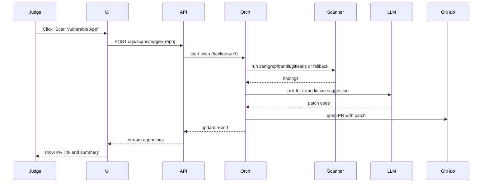

<!-- HERO -->
<p align="center">
  
  <h1 align="center">SecureAgent AI</h1>
  <p align="center"><em>Autonomous DevSecOps — scan, prioritize, patch, and PR</em></p>

</p>


Overview
--------
SecureAgent AI is a multi-agent DevSecOps platform built for Agenthon that showcases autonomous security operations: cloning repositories, running multi-tool SAST scans, enriching findings with threat intelligence, running an agent debate to prioritize risk, generating fixes via LLMs (or fallback templates), and automatically opening PRs with human-readable justifications.

Why this wins (one-liner)
-------------------------
It reduces mean time to remediation from hours to minutes by automating the full detect→triage→remediate loop with explainable agent logs and safe fallbacks.

Showcase highlights
-------------------
- Fully autonomous scan workflow with background orchestration and agent logs
- LLM-assisted remediation with deterministic fallbacks for offline demos
- Automated patching and GitHub PR generation with clear commit messages
- RAG-powered Security Mentor for contextual developer help

Eye-catching Architecture
-------------------------
High-level component diagram and execution flow:

```mermaid
graph LR
  UI[Frontend Dashboard]
  API[FastAPI Backend]
  Orch[Orchestrator Agent]
  Git[GitService]
  Scanner[ScannerService]
  Vector[Chroma Vector DB]
  LLM[LLM Provider (Gemini/OpenAI) or Mock]
  DB[(Postgres / SQLite)]
  GitHub[GitHub]

  UI --> API
  API --> Orch
  Orch --> Git
  Orch --> Scanner
  Scanner --> Orch
  Orch --> Vector
  Orch --> LLM
  Orch --> DB
  Orch --> GitHub

  style Orch fill:#f9f,stroke:#333,stroke-width:2px
```

Sequence of a Winning Demo
-------------------------


Impress with a 2-minute Demo Script (ready-to-read)
-------------------------------------------------
0:00–0:10 — Intro: "This is SecureAgent AI — automated DevSecOps in action."
0:10–0:40 — Trigger: click the `Scan` button for `vulnerable-app`. Show backend logs streaming in the dashboard.
0:40–1:10 — Explain the agent steps as they appear (Scanner → Threat Intel → Debate → Fix).
1:10–1:40 — Show generated patch, open the automated PR and explain the commit message and risk reasoning.
1:40–2:00 — Ask the Security Mentor a targeted question (e.g., "How did you prevent SQLi?") and show the contextual answer.

Judging Rubric Alignment
------------------------
- Innovation (30%): autonomous multi-agent workflow + debate system + LLM remediation
- Impact (30%): measurable reduction in remediation time; automated PR creation for rapid fixes
- Technical Complexity (25%): integrated SAST, vector RAG, background tasks, CI/PR automation
- Presentation (15%): clear demo script, logs, and explainable audit trail

Quickstart (one-liner)
----------------------
Run the full demo locally via Docker: `docker-compose up --build` and open `http://localhost` to access the UI.

Commands (copyable)
-------------------
```bash
# Full stack (recommended)
docker-compose up --build

# Backend dev
cd backend
python -m venv .venv
.venv\Scripts\activate
pip install -r requirements.txt
uvicorn app.main:app --reload --host 0.0.0.0 --port 8000

# Frontend dev
cd frontend
npm install
npm run dev
```

Files to inspect (for judges)
-----------------------------
- Orchestrator & workflow: [backend/app/agents/orchestrator.py](backend/app/agents/orchestrator.py#L1)
- Scanner & fallbacks: [backend/app/services/scanner_service.py](backend/app/services/scanner_service.py#L1)
- Scan endpoints: [backend/app/routers/scans.py](backend/app/routers/scans.py#L1)
- Demo clones: `data/clones/vulnerable-app`

Assets (recommended for final submission)
---------------------------------------
- `assets/demo.gif` — screen capture of scan → PR creation (30s loop)
- `assets/architecture.png` — high-res architecture diagram for judges' slide deck
- `assets/one-pager.pdf` — short summary slide

Where to add polish
-------------------
- Record a 30s demo GIF showing scan → PR creation for the judges (highly recommended).
- Add CI hook that triggers a demo scan on PR to prove automation.
- Add small README `slides/` folder with 3 PPT slides for a quick pitch.

Contact & Live Demo
-------------------
Project owner: Kishanmc — available for live demos and Q&A during Agenthon.

— Good luck! If you want, I can generate the demo GIF placeholder frames and a short slide deck next.
